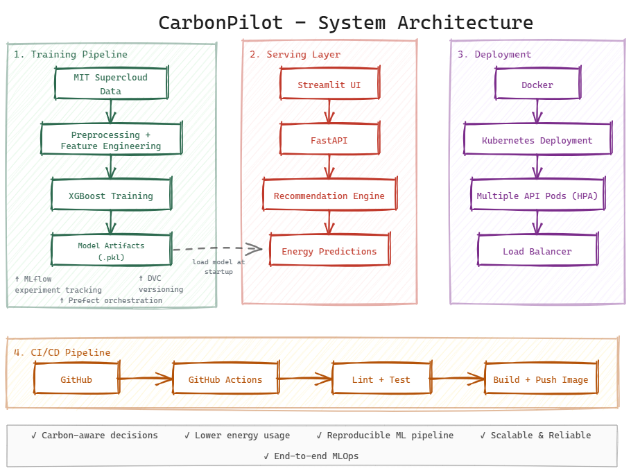

# CarbonPilot

CarbonPilot is a carbon-aware ML system for real workloads.

It takes a job spec, estimates the energy cost, compares a few safe execution options, and returns the best one. The goal is simple: help ML teams waste less compute without adding friction.

## Why it exists

Most ML systems optimize for speed, accuracy, or cost. CarbonPilot adds one more signal that matters: energy.

It is a working pipeline that connects data, modeling, orchestration, serving, deployment, and a clean interface.

## What it does

* reads workload and scheduler data
* trains a model to estimate energy use
* compares execution options
* returns the lowest balanced choice
* serves results through an API
* shows them in a simple UI

## Stack

* Python
* pandas, NumPy, scikit-learn, XGBoost
* MLflow for experiment tracking
* DVC for data and model versioning
* Prefect for orchestration
* FastAPI for serving
* Streamlit for the UI
* Docker for containerization
* Kubernetes for deployment
* GitHub Actions for CI

## System architecture



## Workflow

### Main workflow


### Recommendation output


---

## Kubernetes scaling

CarbonPilot runs behind Kubernetes with multiple API pods. Requests are distributed across replicas during load testing.


---

## Experiment tracking

MLflow is used to track model runs, metrics, and artifacts.


## Data

The project uses the MIT Supercloud dataset. It gives enough structure to model workload behavior without turning this into a synthetic demo.

## Model

The model is an XGBoost regressor trained on job-level features and runtime signals. It estimates energy use, then the recommender tests a small set of configurations and picks the best balanced option.

## How it works

1. Job data comes in.
2. Features are built.
3. The model predicts energy.
4. The recommender compares options.
5. The API returns the best configuration.
6. The UI shows the result in plain language.

## Repo layout

```text
carbonpilot/
├── src/
│   ├── app/
│   ├── data/
│   ├── models/
│   └── pipeline/
├── data/
├── models/
├── k8s/
├── .github/
└── streamlit01.py
```

## Run it locally

### API

```bash
uvicorn src.app.main:app --reload
```

### UI

```bash
streamlit run streamlit01.py
```

### Training

```bash
python src/models/train_model.py
```

### Prefect flow

```bash
python src/pipeline/flow.py
```

## What the system returns

* best config
* predicted energy
* comparison table
* short reason for the choice

## Reproducibility

* Git tracks code
* DVC tracks data and model artifacts
* MLflow tracks experiments
* Prefect runs the pipeline
* GitHub Actions checks the code

## Deployment

The API runs in Docker and on Kubernetes. The UI talks to the API directly.
